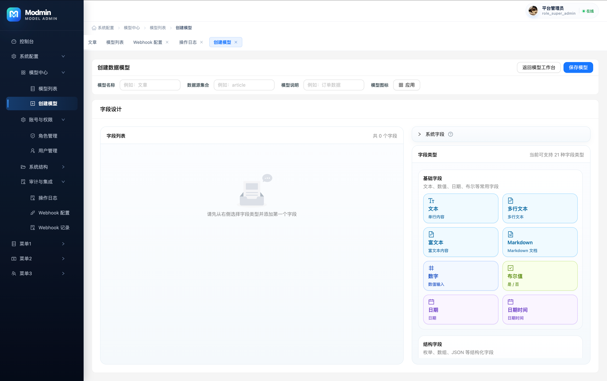
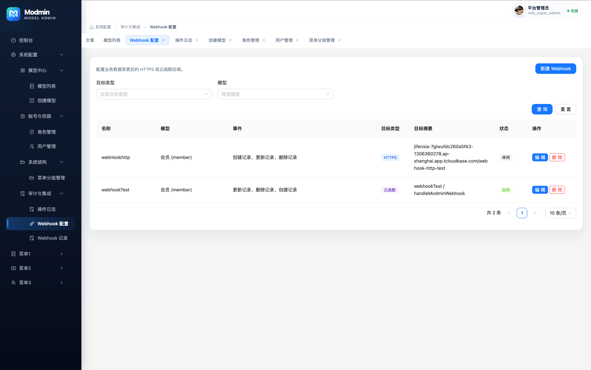
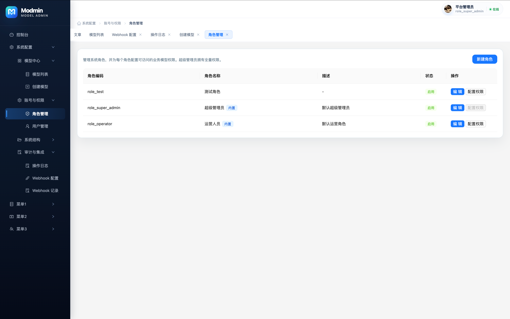
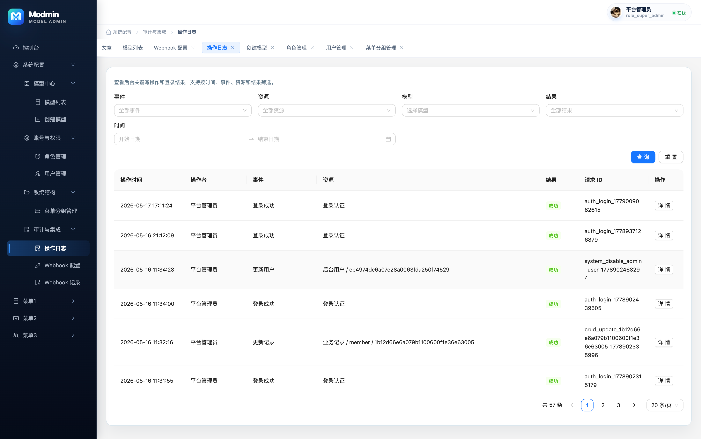
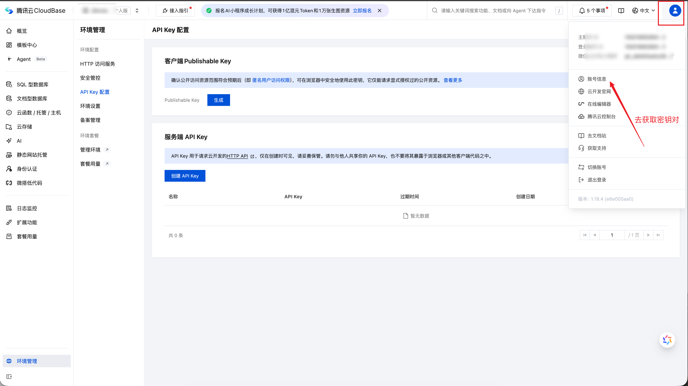
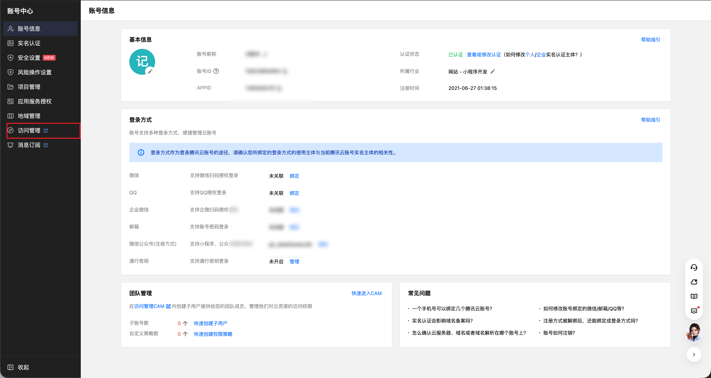
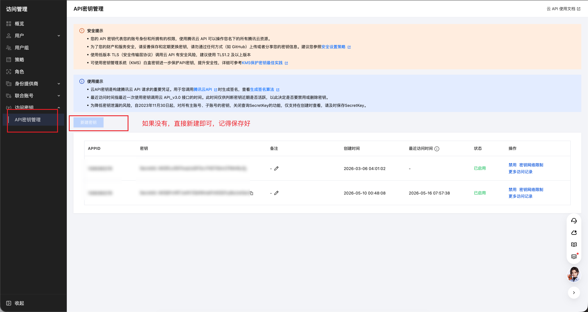
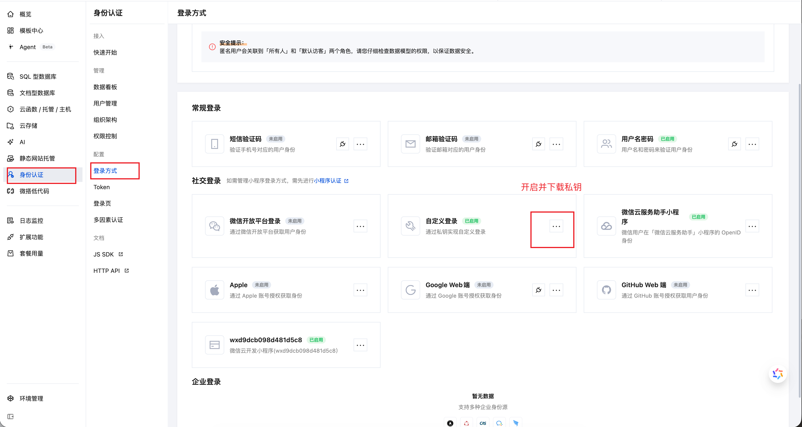
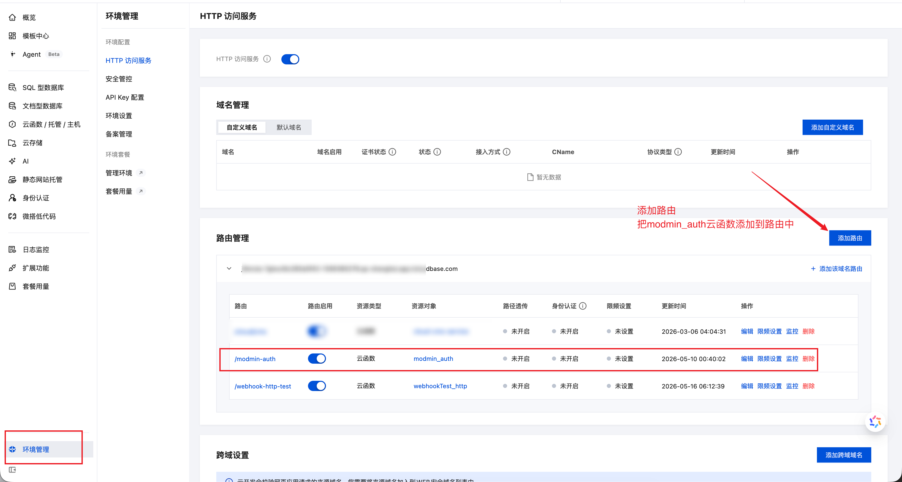
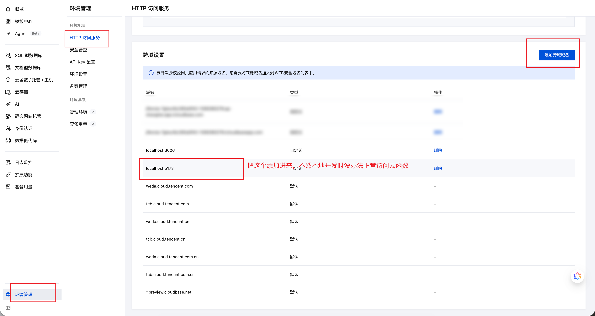

# Modmin

Modmin（中文读法接近摩德敏,自造词来自于model + Admin）是一个基于微信云开发（CloudBase）的模型驱动管理后台模板。

它的目标不是做通用 SaaS 平台，而是帮助单个业务项目更快搭建一套可部署、可鉴权、可按模型生成 CRUD 页面的后台系统。

⚠️注意：目前项目仍在不断完善中，欢迎内测体验提交bug反馈。

部分功能页面截图










## 核心能力

1. 模型定义与字段配置
2. 基于模型生成 CRUD 页面
3. 后台账号、角色与权限管理
4. CloudBase 云函数统一承载后端逻辑
5. 审计日志与 Webhook 基础能力

## 适用场景

适合：

1. 基于微信云开发搭建独立业务后台。
2. 需要“模型配置 + 后台生成”能力的项目。
3. 希望前端、权限、CRUD、部署方式保持统一的团队。

不适合：

1. 多租户 SaaS 平台。
2. 完整低代码页面设计器。
3. 无 CloudBase 依赖的通用 Node.js 后台脚手架。

## 技术栈

1. 前端：React 18 + Vite + Ant Design
2. 后端：CloudBase 云函数
3. 数据：CloudBase 数据库（云环境自带的mangoDB）
4. 测试：Vitest

## 仓库结构

```text
doc/                部署指南等公开文档
web-admin/          前端管理后台
cloudfunctions/     云函数
local-server/       本地云函数调试服务器（约等于本地调用云函数的功能，避免本地开发时修改云函数频繁部署更新云函数）
shared/             前后端共享类型
configs/            环境与平台配置
scripts/            部署与辅助脚本
tests/              测试
```

## 文档

1. [部署指南](doc/部署指南.md) — 完整部署文档（含命令行部署、附录等）
2. [运行模式说明](doc/运行模式说明.md) — mock / http / tcb 三种运行模式详解

## 一键部署（推荐）

通过后台「开发部署」页面完成全流程部署，**无需手动执行命令行**。系统会自动完成集合创建、云函数部署、前端构建上传、初始超管创建。

### 前提条件

1. 一个 CloudBase 环境（微信云开发），已开通数据库、云函数、静态托管

2. 腾讯云 API 密钥（[SecretId / SecretKey](https://console.cloud.tencent.com/cam/capi)）

   

   

   

3. 从 CloudBase 控制台下载自定义登录私钥文件 `tcb_custom_login.json。放到**cloudfunctions/modmin_auth/tcb_custom_login.json**下



3. 开放modmin_auth云函数公网访问。



3. 配置安全域名列表，添加两个**localhost:5173**、**localhost:3000**，截图只有一个，懒得更新了。



### 启动本地环境

```bash
# 1. 安装依赖
npm install
npm --prefix web-admin install
npm --prefix local-server install

# 2. 配置本地凭据
#    复制 local-server/cloudbase.local.example.json 为 local-server/cloudbase.local.json
#    填入 envId、secretId、secretKey、jwtSecret（openssl rand -hex 32 生成）

# 3. 启动本地云函数服务
cd local-server && npm run dev

# 4. 启动前端（另开终端）
cd web-admin && npm run dev
```

### 一键部署操作

根据引进入一键部署页面后：

1. 填写部署参数：

| 参数 | 说明 |
| --- | --- |
| **环境 ID** | CloudBase 环境 ID |
| **地域** | 环境所在地域（如 `ap-shanghai`） |
| **API 密钥** | 腾讯云 SecretId / SecretKey |
| **JWT 密钥** | 可自动生成或手动输入（至少 32 字符） |
| **自定义登录私钥** | `tcb_custom_login.json` 文件，如果没有显示读取到，把文件放到**cloudfunctions/modmin_auth/tcb_custom_login.json** |
| **auth接口路由** | 开放modmin_auth云函数的公网访问 |
| **部署目录** | 前端部署路径（根目录填 `/`，子目录如 `/modmin/`） |

2. 点击「开始部署」，右侧日志面板会实时显示进度

### 部署内容

一键部署会自动完成以下全部步骤：

- ✅ 创建 9 个系统集合（`modmin_collections`、`modmin_admin_users` 等）
- ✅ 部署 7 个云函数 + 注入环境变量（含 `MODMIN_JWT_SECRET`）
- ✅ 构建前端并上传到 CloudBase 静态托管
- ✅ 创建初始超级管理员账号
- ✅ 补齐内置角色（`role_super_admin`、`role_operator`）

### 部署完成后

1. 用日志中输出的管理员账号密码登录
2. **立即修改初始密码**
3. 进入「角色管理」确认内置角色已存在
4. 进入「模型管理」点击「新建模型」，能正常保存即表示部署成功

> ⚠️ 一键部署会直接操作生产环境，请确认 API 密钥指向正确的环境。
>
> 需要命令行部署或更多细节，请参考 [部署指南](doc/部署指南.md)。

## 命令行部署

适合需要精细控制部署流程、或在 CI/CD 环境中使用的场景。

```bash
# 部署全部云函数
export MODMIN_JWT_SECRET=$(openssl rand -hex 32)
npm run deploy:fn

# 构建并部署前端
npm run deploy:web

# 或一次搞定
npm run deploy:all
```

完整步骤（含环境准备、集合创建、HTTP 触发器配置、初始超管创建等）请参考 [部署指南 - 命令行部署](doc/部署指南.md)。

## 本地开发

### 方式一：本地云函数服务（http 模式，推荐）

这是当前推荐的日常开发方式。

```bash
# 终端 1：启动本地云函数服务
cd local-server && npm run dev

# 终端 2：启动前端
cd web-admin && npm run dev
```

前端默认请求本地 `http://localhost:3100`。

### 方式二：Mock 模式

适合轻量 UI 演示，很多核心功能无法覆盖。

```bash
cd web-admin && npm run dev
```

### 方式三：连接云端环境（tcb 模式）

完成部署后，复制并填写生产配置：

```bash
cp web-admin/.env.production.example web-admin/.env.production.local
cd web-admin && npm run dev
```

> 运行模式详细说明见 [运行模式说明](doc/运行模式说明.md)。

## 常用命令

仓库根目录常用命令如下：

```bash
# 测试
npm test
npm run test:watch

# 部署
npm run tcb:login                          # 登录 CloudBase
export MODMIN_JWT_SECRET=$(openssl rand -hex 32)
npm run deploy:fn                          # 部署全部云函数
npm run deploy:fn:single -- modmin_auth    # 部署单个云函数
npm run build:web                          # 构建前端
npm run deploy:web                         # 部署前端到静态托管
npm run deploy:all                         # 云函数 + 前端一起部署
```

## 环境文件约定

前端环境文件职责如下：

1. `web-admin/.env.development`：本地默认开发配置，一般不用改动
2. `web-admin/.env.production.example`：生产模板配置示例
3. `web-admin/.env.production.local`：真实生产配置，部署到云开发的静态托管时会使用本配置

## 测试

运行全部测试：

```bash
npm test
```

监听模式：

```bash
npm run test:watch
```

## 当前公开范围说明

为了保证公开仓库可控，当前仓库只保留公开使用者需要的文档与代码。

以下内容不会进入公开仓库：

1. 私有规划文档
2. 本地凭据
3. CloudBase 自定义登录私钥
4. 本机环境覆盖配置

## 状态说明

当前项目仍处于持续整理阶段，但已经具备：

1. 基础部署路径
2. 云函数与前端主流程
3. 基础测试
4. 模型驱动 CRUD 主链路

如果你准备试用，建议优先按部署指南完整走一遍，而不是直接从页面代码开始看。

作者微信：

